# Assignment 1 Report
> This report is written with the assistance of codex-5.3.

## Task 01 Report (Monoalphabetic Substitution Cipher)

Recovered all 26 substitutions and decrypted meaningful English plaintext.

```text
a -> c
b -> f
c -> m
...
y -> t
z -> u
```

```text
the oscars turn on sunday which seems about right after this long strange awards trip...
```

## Task 02 Report (OpenSSL enc with Multiple Ciphers)

Tested `-aes-128-cbc`, `-aes-128-cfb`, and `-aes-128-ofb` with encrypt-then-decrypt validation.

```text
sha256(original) == sha256(decrypted) for all three modes
- -aes-128-cbc: identical
- -aes-128-cfb: identical
- -aes-128-ofb: identical
```

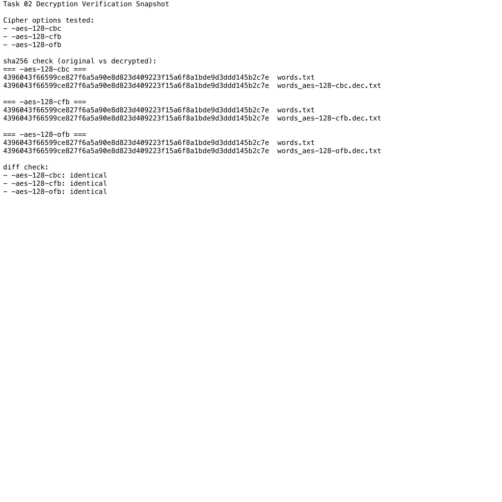

Screenshot note: the image above captures checksum and `diff` verification in one view.

## Task 03 Report (ECB vs CBC on BMP)

Encrypted BMP pixel body while preserving BMP header. ECB leaks visual patterns; CBC hides structure much better.

```bash
# Keep header, encrypt body, and rebuild BMP
openssl enc -aes-128-ecb -e -nosalt -in body.bin -out body_ecb.bin -K "$KEY_HEX"
openssl enc -aes-128-cbc -e -nosalt -in body.bin -out body_cbc.bin -K "$KEY_HEX" -iv "$IV_HEX"
cat header.bin body_ecb.bin > out_ecb.bmp
cat header.bin body_cbc.bin > out_cbc.bmp
```


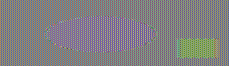


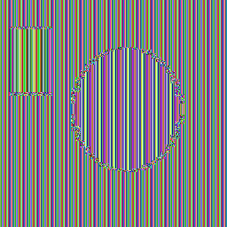


## Task 04 Report (Padding)

Verified which modes require padding and inspected PKCS#7 bytes.

```text
Mode padding size check (input = 21 bytes):
ecb: 32
cbc: 32
cfb: 21
ofb: 21
```

```text
f5  last block:  31 32 33 34 35 0b 0b 0b 0b 0b 0b 0b 0b 0b 0b 0b
f10 last block:  31 32 33 34 35 36 37 38 39 30 06 06 06 06 06 06
f16 last block:  10 repeated 16 times
```

## Task 05 Report (Error Propagation)

Corrupted one ciphertext byte and compared diffusion by mode.

```text
ecb: different_bytes=16
cbc: different_bytes=17
cfb: different_bytes=17
ofb: different_bytes=1
```

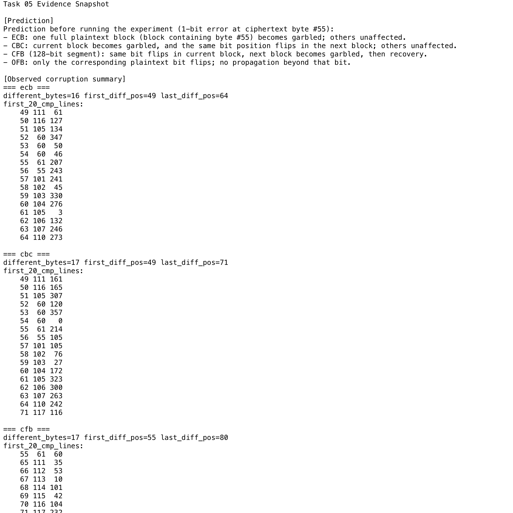

## Task 06 Report (IV Experiments)

Showed IV effect on CBC first block, recovered OFB second message with IV reuse, and demonstrated predictable-IV chosen-plaintext inference.

```text
IV1 first run == IV1 second run ? yes
IV1 first run == IV2 run ? no
```

```text
Recovered P2 text : Order: Launch a missile!
Inference (predictable-IV test): P1 is Yes
```

## Task 07 Report (Crypto Library Programming)

Implemented dictionary-based brute-force AES-CBC decryption with OpenSSL EVP API.

```c
if (plain_len == (int)strlen(target_plain) && memcmp(plain, target_plain, plain_len) == 0) {
    printf("Recovered dictionary word key: %s\n", line);
}
```

```text
Recovered dictionary word key: Syracuse
Padded 128-bit key: Syracuse########
Decrypted plaintext: This is a top secret.
```

## Task 08 Report (Two Different Files with Same MD5)

Generated collision pairs and verified same MD5 for two different binaries.

```text
[non64] out1_non64.bin != out2_non64.bin
md5(out1_non64.bin) = 88085b538d8d9e243c91fd76fcca47ff
md5(out2_non64.bin) = 88085b538d8d9e243c91fd76fcca47ff

[len64] out1_64.bin != out2_64.bin
md5(out1_64.bin) = 7cc4cac2bcc2d538e6b7fa0b20858d78
md5(out2_64.bin) = 7cc4cac2bcc2d538e6b7fa0b20858d78
```

## Task 09 Report (MD5 Property)

Verified collision-preserving property under common suffix append.

```text
Base:  md5(M) == md5(N)
After appending same T: md5(M||T) == md5(N||T)
```

```text
md5(M_plus_T.bin) = 2fc5662f9d149f666a8566446f847f37
md5(N_plus_T.bin) = 2fc5662f9d149f666a8566446f847f37
```

## Task 10 Report (Two Executables with Same MD5)

Produced two executable files with identical MD5 but different embedded payload bytes.

```text
md5(task10_prog1) = 5b466ac9bda2c431c03bdf787c85b3b2
md5(task10_prog2) = 5b466ac9bda2c431c03bdf787c85b3b2
```

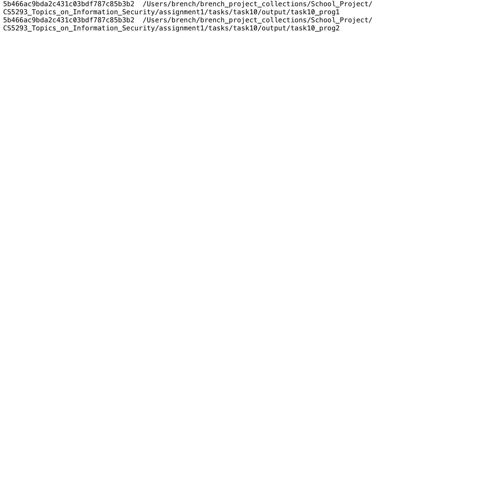

```c
unsigned char xyz[200] = { 0x41, 0x41, ... };
for (i = 0; i < 200; i++) {
    printf("%02x", xyz[i]);
}
```

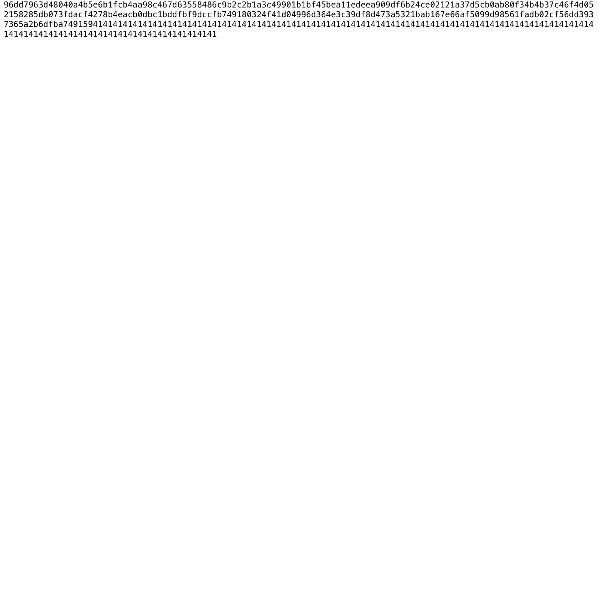
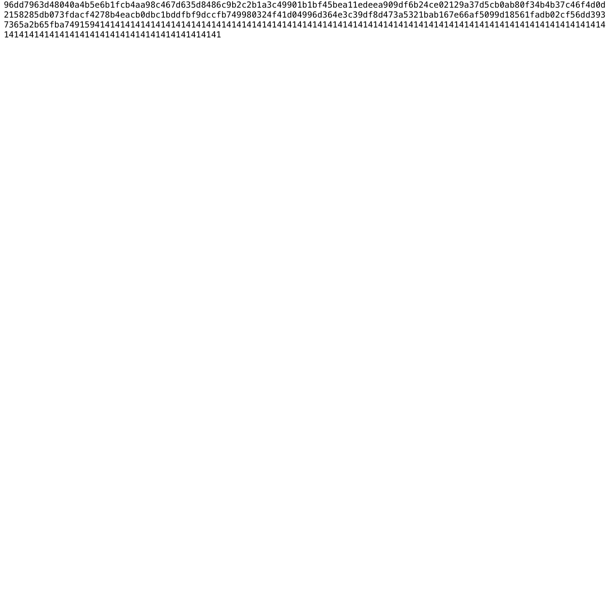

Screenshot note: the two runtime-output screenshots show differing printed `xyz` bytes despite identical binary MD5.

## Task 11 Report (Make Programs Behave Differently)

Created same-MD5 executables that branch differently at runtime.

```c
if (memcmp(X, Y, 128) == 0) {
    printf("Benign branch executed...\n");
} else {
    printf("Malicious branch executed...\n");
}
```

```text
md5(task11_prog_benign)    = bf3cd288f0a6b59d804b6095cc6ab043
md5(task11_prog_malicious) = bf3cd288f0a6b59d804b6095cc6ab043
```

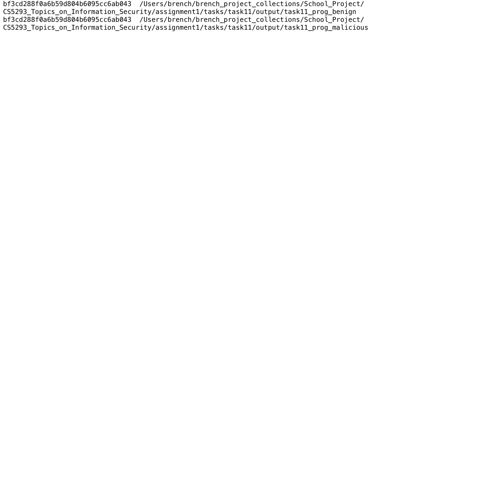
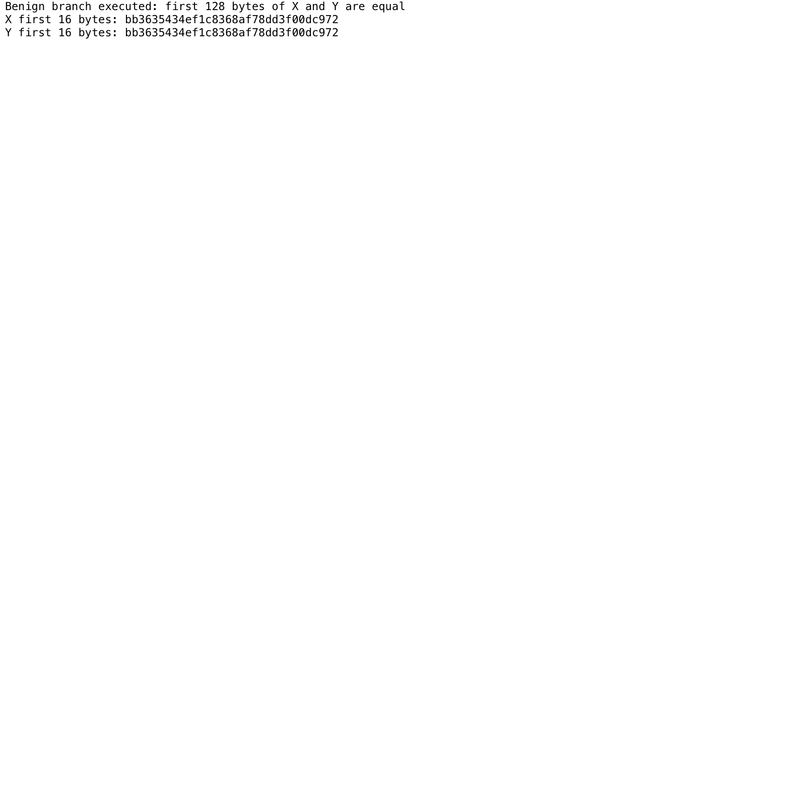
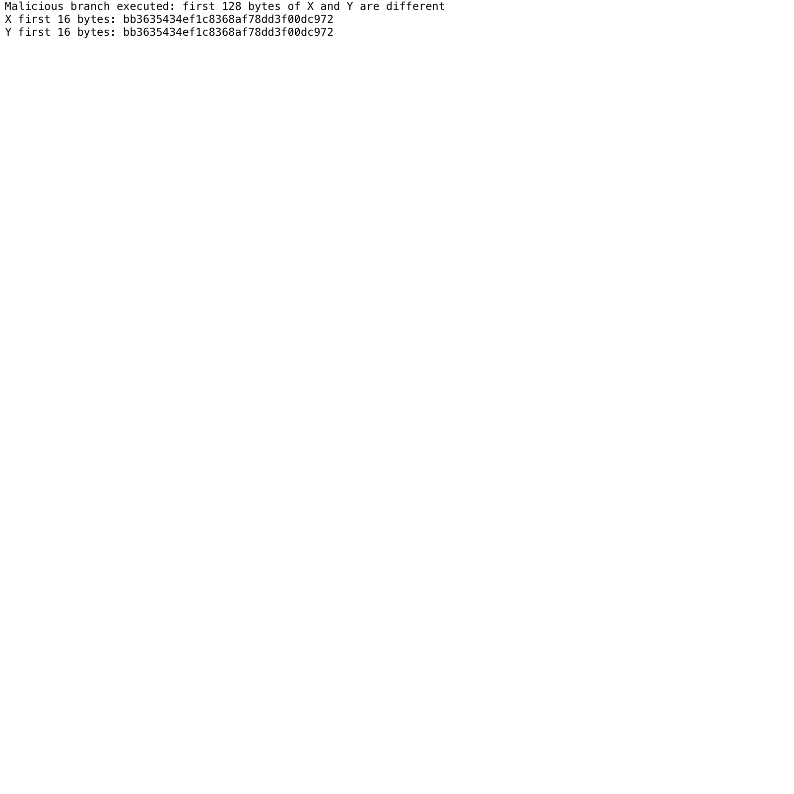

Screenshot note: branch outputs differ (`Benign` vs `Malicious`) while MD5 remains the same.

## Task 12 Report (Deriving the Private Key)

Computed RSA modulus, Euler phi, and private exponent `d` from given `p`, `q`, `e`.

```text
n = E103ABD94892E3E74AFD724BF28E78366D9676BCCC70118BD0AA1968DBB143D1
phi(n) = E103ABD94892E3E74AFD724BF28E78348D52298BD687C44DEB3A81065A7981A4
d = 3587A24598E5F2A21DB007D89D18CC50ABA5075BA19A33890FE7C28A9B496AEB
(e*d) mod phi(n) = 01
```

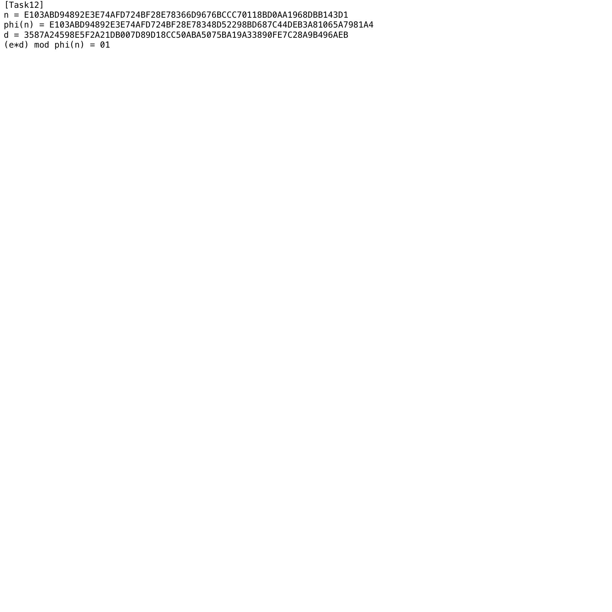

## Task 13 Report (Encrypting a Message)

Encrypted `A top secret!` with RSA public key and verified decryption with private key.

```text
M ASCII = A top secret!
C hex = 6FB078DA550B2650832661E14F4F8D2CFAEF475A0DF3A75CACDC5DE5CFC5FADC
Decrypted ASCII = A top secret!
```

## Task 14 Report (Decrypting a Message)

Decrypted the provided ciphertext using private key.

```text
M ASCII = Password is dees
```

## Task 15 Report (Signing a Message)

Generated RSA signatures for two payment strings.

```text
M1 = I owe you $2000.
S1 = 55A4E7F17F04CCFE2766E1EB32ADDBA890BBE92A6FBE2D785ED6E73CCB35E4CB

M2 = I owe you $3000.
S2 = BCC20FB7568E5D48E434C387C06A6025E90D29D848AF9C3EBAC0135D99305822
```

## Task 16 Report (Verifying a Message)

Implemented `S^e mod n` verification for original and modified signatures.

```c
BN_mod_exp(m_from_sig_ok, s_ok, e, n, ctx);
BN_mod_exp(m_from_sig_bad, s_bad, e, n, ctx);
printf("Verification  = %s\n", BN_cmp(m_from_sig_ok, m_expected) == 0 ? "VALID" : "INVALID");
```

```text
[Given Signature]      Verification = INVALID
[Corrupted Signature]  Verification = INVALID
```

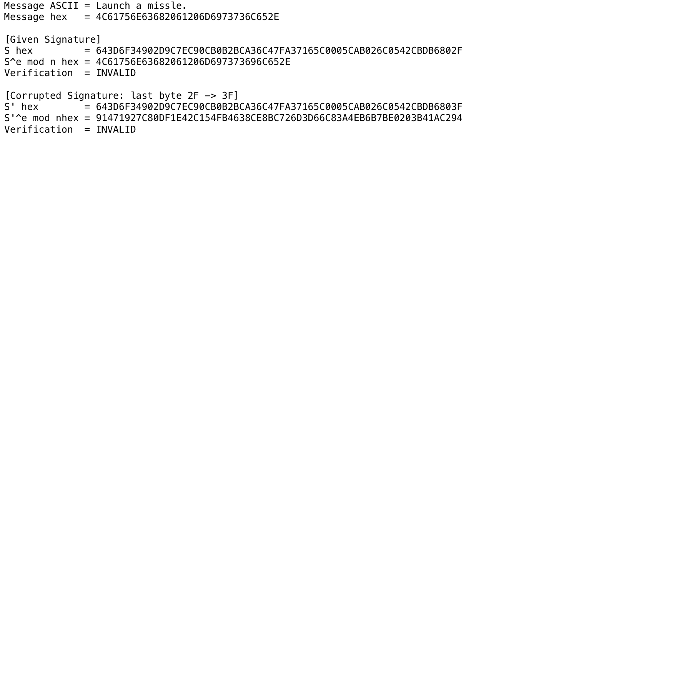

## Task 17 Report (Manual X.509 Verification)

Extracted `www.chase.com` certificate chain and manually verified digest/signature consistency against issuer key.

```text
Issuer: DigiCert EV RSA CA G2
Signature Algorithm: sha256WithRSAEncryption
PKCS#1 v1.5 digest check = VALID
```

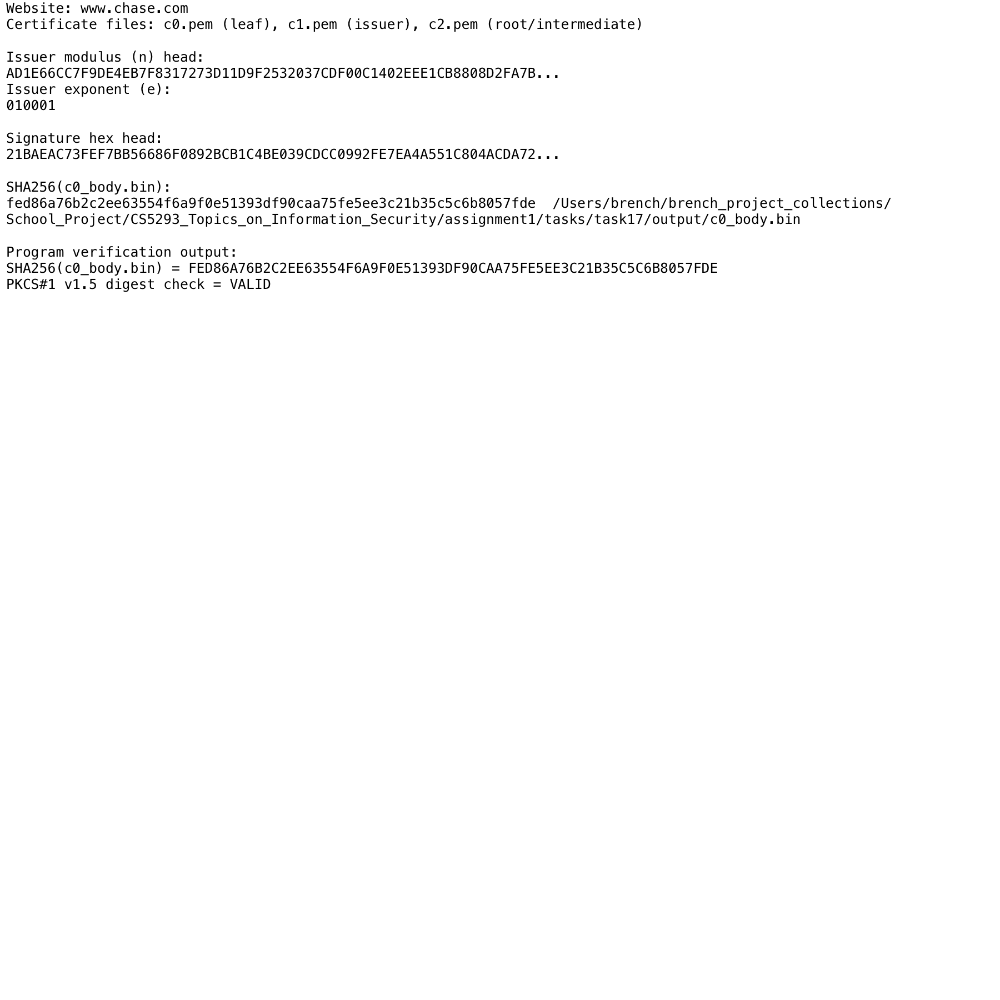

## Task 18 Report (Bad Key Generation)

Compared key generation with and without `srand(time(NULL))`.

```text
Run B (without srand): a7f1d92a82c8d8fe434d98558ce2b347
Run C (without srand): a7f1d92a82c8d8fe434d98558ce2b347
```

Conclusion: without proper seeding, the pseudo-random key sequence repeats deterministically.

## Task 19 Report (Guessing the Key)

Brute-force seed search over an epoch range using known plaintext/ciphertext block constraints.

```c
for (seed = start; seed <= end; seed++) {
    srand((unsigned int)seed);
    for (i = 0; i < 16; i++) key[i] = (unsigned char)(rand() % 256);
    if (memcmp(out, pt_known, 16) == 0) { /* FOUND */ }
}
```

```text
search_start_epoch=1523970529
search_end_epoch=1523977729
NOT_FOUND
```

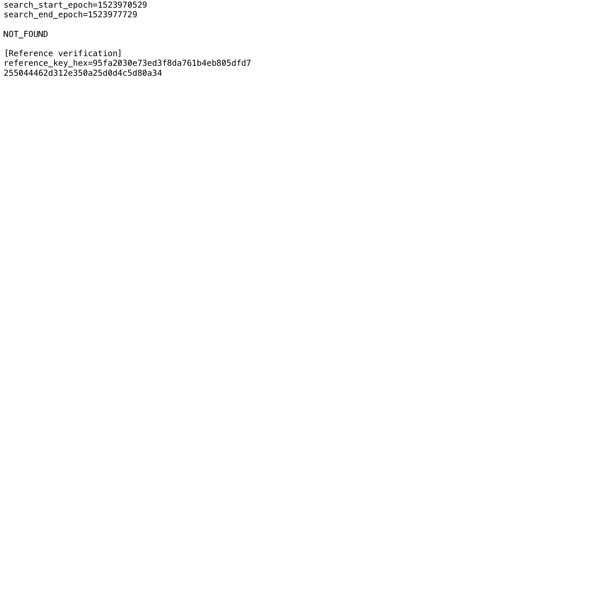

## Task 20 Report (Kernel Entropy Measurement)

On this platform, `/proc/sys/kernel/random/entropy_avail` is unavailable; used fallback timing observation.

```text
Read 64KB from /dev/random duration_seconds=0
Read 64KB from /dev/urandom duration_seconds=0
```

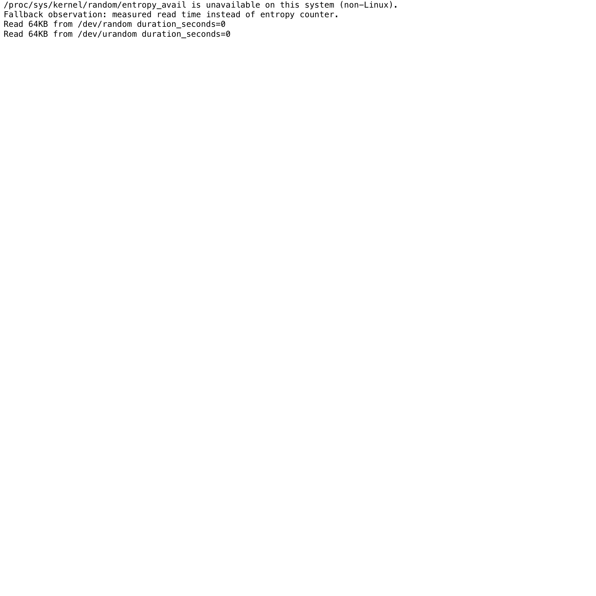

## Task 21 Report (/dev/random Behavior)

Monitored data generation behavior and DoS implication discussion.

```text
Duration_seconds=8
Final_bytes_from_dev_random=1048576
Blocked_or_slow=...=no
```

Security note: heavy demand on `/dev/random` can reduce entropy availability and potentially delay key generation services.

## Task 22 Report (/dev/urandom + Statistical Check)

Generated random stream from `/dev/urandom`, evaluated entropy quality with `ent`, and generated 256-bit key from `/dev/urandom` in C.

```c
FILE *random = fopen("/dev/urandom", "rb");
fread(key, sizeof(unsigned char), 32, random);
```

```text
Entropy = 7.999837 bits per byte
Serial correlation coefficient = -0.001049
Generated 256-bit key (hex) = fd47b052e9d050aea48197b0961e25cb3bbdcfda1174d22d714bf16ebdcac75e
```

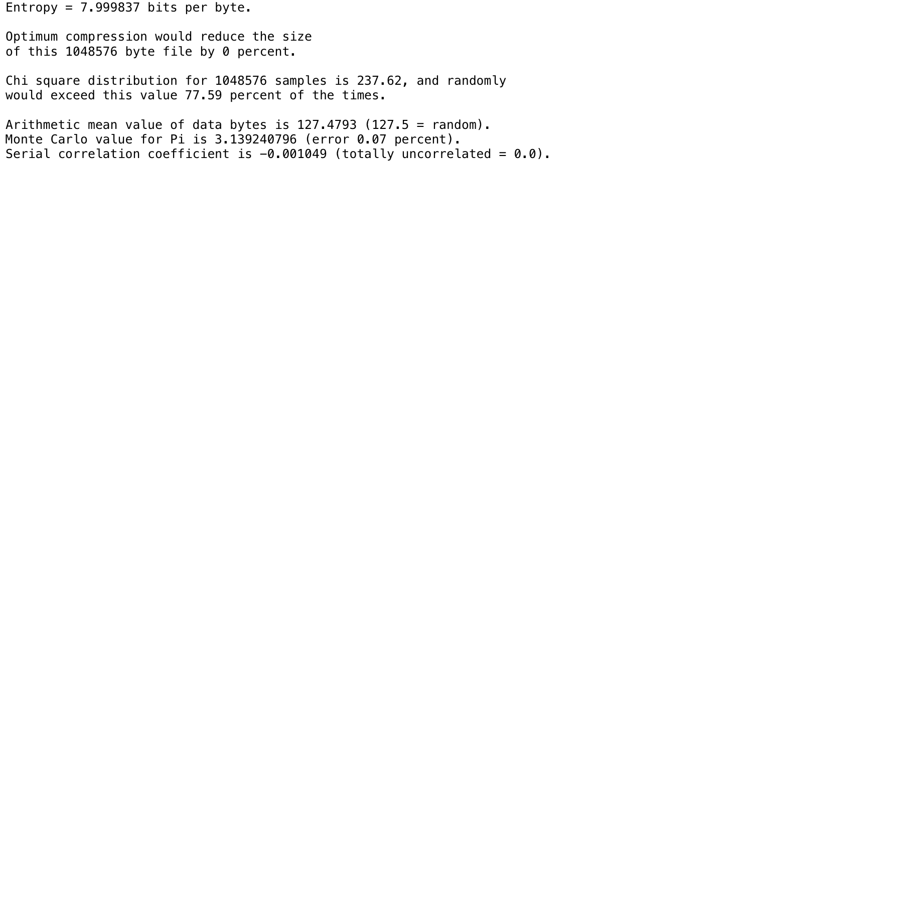

---

End of standalone report.
